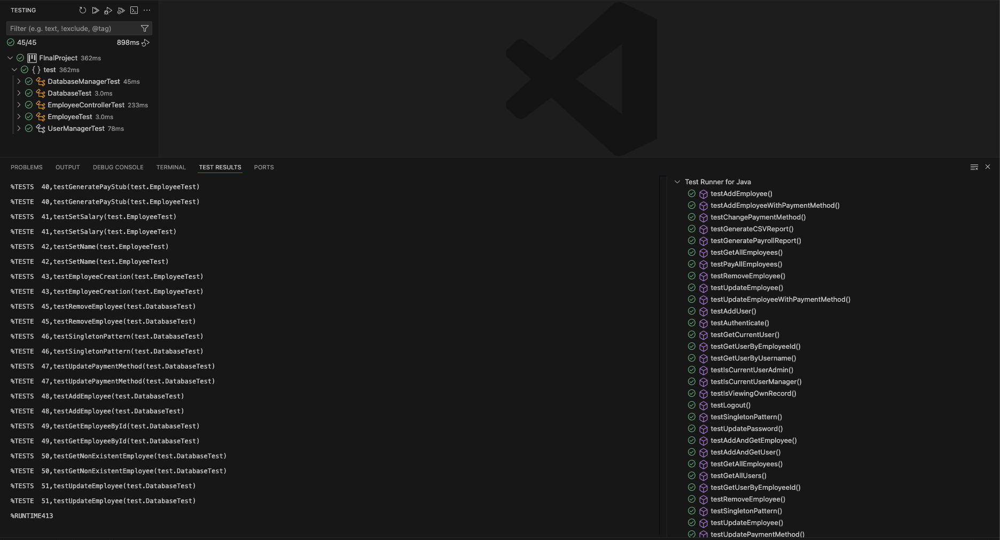

# Employee Management System

## **Project Overview**
The **Employee Management System** is a Java-based application designed to streamline the management of employee records, payroll processing, and administrative tasks for HR personnel. The system provides a **Graphical User Interface (GUI)** for intuitive interaction and follows a structured **Model-View-Controller (MVC) architecture**.

## **Features**
### **Completed Features:**
- ✅ **Employee CRUD Operations**: Add, edit, remove, and view employees.
- ✅ **Payroll Processing**: Pay employees via different payment methods.
- ✅ **GUI with JTable**: Interactive employee list with inline edit and delete options.
- ✅ **Input Validation**: Form validation to ensure data integrity.
- ✅ **Data Persistence**: Using SQLite database for permanent storage.
- ✅ **Role-based Authentication (RBAC)**: Admin, Manager, and Employee access roles.
- ✅ **Report Generation**: CSV and PDF export of employee and payroll data.
- ✅ **Search Functionality**: Find employees by ID.
- ✅ **Payment Method Selection**: Employees can select different payment methods (Direct Deposit, Check).
- ✅ **Automatic ID Generation**: Employee IDs are auto-generated based on database records.
- ✅ **Employee Accounts**: Each employee added gets their own login account.
- ✅ **Design Pattern Integration**:
  - **Singleton Pattern** (Database connection)
  - **Factory Pattern** (Employee object creation)
  - **Strategy Pattern** (Multiple payment methods: Direct Deposit, Check)
  - **Observer Pattern** (Real-time updates in the GUI)
  - **Mediator Pattern** (Controller handling business logic)
- ✅ **JUnit 5 Unit Testing** for core functionalities.
- ✅ **Error Handling and Logging**: Comprehensive system for tracking operations and errors.

## **Installation & Setup**
### **Prerequisites:**
- Java **21**
- SQLite JDBC Driver (3.36.0.3 or newer)
- JUnit 5 (for running tests)

### **Steps to Run:**
1. Clone the repository:
   ```sh
   cd EmployeeManagementSystem
   ```
2. Add SQLite JDBC driver to your classpath:
   ```sh
   # Download the driver from https://github.com/xerial/sqlite-jdbc/releases
   # Add to lib folder
   ```
3. Compile and run the application:
   ```sh
   javac -d bin -cp "lib/*" src/**/*.java
   java -cp "bin:lib/*" main.EmployeeManagementApp
   ```
4. To run the **JUnit tests**:
   ```sh
   Run the tests through VSCode   # If using VSCode
   ```

## **Usage Guide**
1. **Login Page**:
   - Use default admin credentials: Username: `admin`, Password: `admin123`
   - Use default manager credentials: Username: `manager`, Password: `manager123`
   - For employees: Username is their name (lowercase with underscores), Password is their ID + first 3 letters of name
   
2. **Home Page**:
   - Admins: Full access to all features
   - Managers: Can manage employees but not generate reports
   - Employees: Can only view their own record and change password

3. **Employee Management**:
   - Add Employee: Creates new employee record with auto-generated ID
   - View Employees: Shows list of employees (based on role permissions)
   - Pay All Employees: Processes payments according to chosen payment methods

4. **Reports**:
   - Generate CSV reports for employee data
   - Generate PDF reports for employee data and payroll

## **JUnit Testing**
JUnit 5 is used to validate business logic, database operations, and user authentication.

**Tested Components:**
- ✅ **EmployeeControllerTest**: Ensures correct CRUD operations and report generation.
- ✅ **DatabaseTest**: Confirms Singleton pattern and database integrity.
- ✅ **EmployeeTest**: Validates employee object creation and paystub generation.
- ✅ **UserManagerTest**: Tests authentication and role-based permissions.
- ✅ **DatabaseManagerTest**: Tests SQLite persistence operations.

Run tests using:
```sh
Run the tests through VSCode   # If using VSCode
```

Test cases Results:



## **Database Schema**
The system uses SQLite with the following tables:
- **employees**: Stores employee details (id, name, department, salary, payment_method)
- **users**: Stores user accounts (username, password, role, employee_id)

## **License**
This project is open-source and licensed under the **MIT License**.

## **Contributors**
- **Krutik Bajariya**

## **Future Enhancements**
- 📌 User Management Interface for adding/removing users
- 📌 Enhanced Reporting with charts and graphs
- 📌 Department Management features
- 📌 Email notifications for payroll
- 📌 Dashboard with statistical overview